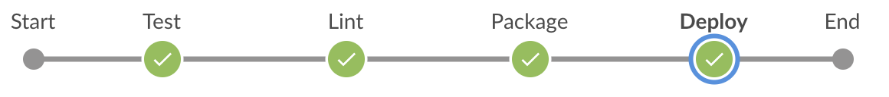
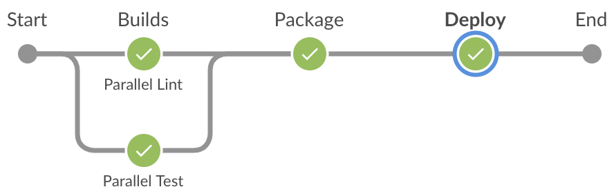
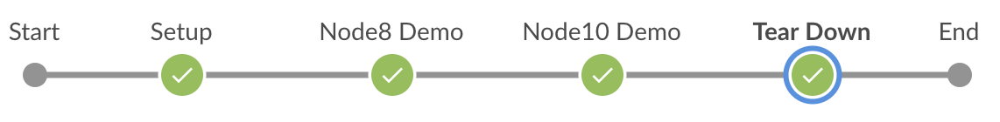
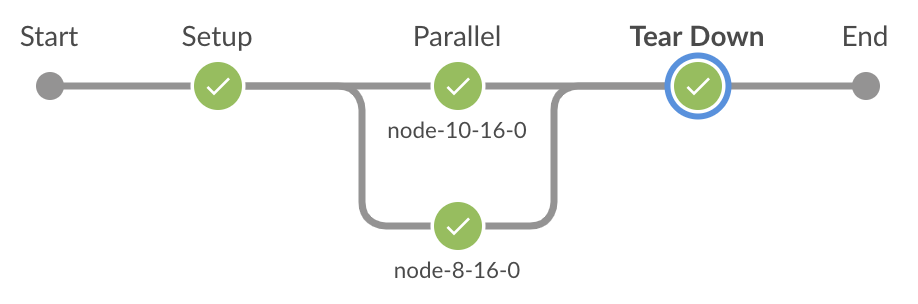
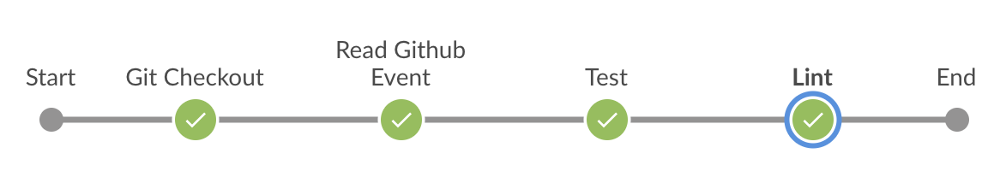
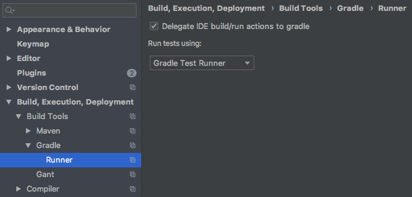

# Jenkins DSL

The Jenkins DSL is a project originally developed by [Eli Lilly and Company](https://www.lilly.com/) and [DMI's Application Development division](https://dminc.com/what-we-do/enterprise-application-development/) as the foundation for all of Lilly's Jenkins pipelines. 
Inside this repository you will find how we build basic pipelines, create and run docker images, and how we delegate our 
code to run on our openshift cluster. 

## Installation

### As a shared library
In Jenkins, you are going to have to configure this package as a shared library. Here is some information on how to do that.
https://www.jenkins.io/doc/book/pipeline/shared-libraries/. It is important to note how to set up multiple sets of shared libraries that work together. That can also be found in that document. 

In order to get this to work as a shared library, you are going to have to make sure you have installed the following plugins: 
1. https://plugins.jenkins.io/openshift-client/
2. https://plugins.jenkins.io/pipeline-utility-steps/

If you are looking to use what we have directly, then your Jenkins instance must be running on OpenShift. We host our images in Artifactory so if you are looking to set that up as well, it will likely be easiest to host from Artifactory to start. Obviously, this a great place for the community to come in and contribute back as many teams are not running Jenkins on OpenShift or hosting their images in Artifactory. 

These will allow you to run our shared library core. Also, you are going to need to set up some custom credentials. For example, `default-docker-credentials` living in your Jenkins space will allow you to work with Docker. Here is a list of the credentials you are likely going to need to set up. 

1. Docker : We use this as a credential in our Jenkins instance to pull images.
2. GitHub : We use this as a Personal Access Token that has access to any repository in our org that we need to read from. 
3. OpenShift : We have created a service account on our OpenShift instance that allows us to work with it to run specific builds.

### Extending from these Libraries
There are a few places to be aware of when extending these libraries.
1. `ArtifactoryImage`: This class is setup with defaults for Lilly's artifactory registry. When extending, this is obviously going to need to be given the correct parameters that are specific to your registry.
2. `OpenshiftClient`: This class is going to need decorated or modified if you intend to reuse the `runInPod` method. Currently, this is intended for use with our current openshift implementation. We have it in our backlog to update this so that it is easier to use. For now however, this is going to need some modification. Here is a run down of what needs changed:

| Change | Line Number | Description |
| --- | --- | --- |
| `containerName` | 55 | This is the name of the default container name that we run when we create a pod. This will need modified or passed in based on which container you would like to run when a new pod is generated.|
| `image` | 58 | Our image name is going to need changed to whichever image you would like to run when `runInPod` is called.|
| `serviceAccount` | 62 | This is the name of the service account that we have added to our Openshift instance. You are going to want to replace that with the service account that you create on your Openshift.|


### As a dependency in your project
This will allow you to extend off of the core and create your own custom stages for running your own steps. In order to do this,
you will have to add this [package](https://github.com/EliLillyCo/jenkinsdsl/packages) to your gradle dependencies. Then you will need to rebuild your
project. Then, you will have access to all classes and files that exist in this project. 


## DSL Methods Common To All Pipelines

These methods are available to all pipelines and can be accessed using the `freeFormPipeline {...}` DSL.

| Method | Description | Arguments| Relevant Sections |
| --- | --- | --- | --- |
| `Scope root()` | Returns the outermost scope of the given scope. | n/a |  [Variable Scoping and Field Protection](#variable-scoping-and-field-protection) |
| `Scope root(String field)` | Starting from the current scope, returns the outermost scope that defines the field. | `field`: A field name  |  |
| `Scope nearest(String field)` | Starting from current scope, returns the nearest scope that defines the field. | `field`: A field name | |
| `T withJenkins(Closure<T> body)` | Delegates calls to all methods and fields in the closure to the Jenkins' script processing object. Returns what the last statement evaluates to in the closure. | `body`: A Closure body to execute | [Running Pipeline Code](#running-pipeline-code) |
| `def runBlock(String name, Closure body)` | Executes the supplied closure and returns what the closure returns. | `name`: Name of the block (optional), <br/>`body`: A closure to execute as a part of the block. | [Grouping Similar Stages](#grouping-similar-stages) |
| `def runParallel(String name, Closure body)` | Executes the supplied closure and returns what the closure returns. | `name`: Name of the parallel block (optional), `body`: A closure to execute as a part of the parallel block. | [Running Stages in Parallel](#running-stages-in-parallel) |
| `def runTask(String name, Closure body)` | Executes the supplied closure and returns what the closure returns. | `name`: Name of the parallel task, <br/>`body`: A closure to execute as a part of the parallel task. | [Running Stages in Parallel](#running-stages-in-parallel) |
| `def onFinish(Closure body)` | Registers the closure to handle clean up logic after the block finishes execution. | `body`: A closure to execute | [Specifying Clean Up Logic](#specifying-clean-up-logic) |
| `void configureCredentials(Map nsToRegistryToCredId)` | Creates an Openshift secret for each namespace to registry to credential id entry to be later used in pulling and pushing images. | `nsToRegistryToCredId`: namespace mapped to registry uri mapped to Jenkins credential store id | [Configuring Docker Credentials](#configuring-docker-credentials) 
| `void deleteCredentials()` | Deletes all Openshift secrets created by the `configureCredentials()` method. | n/a | [Deleting Docker Credentials](#deleting-docker-credentials) |
| `void runSetup(Closure body)` | Runs the setup logic in a pod before running containers. | `body`: A code block to execute as a part of the pod setup. | [Running Containers in a Pod](#running-containers-in-a-pod) |
| `void runTearDown(Closure body)` | Runs the tear down logic in a pod after all containers have finished running. | `body`: A code block to execute as a part of cleanup before the pod terminates. | [Running Containers in a Pod](#running-containers-in-a-pod) |
| `void runPod(String nameSpace, Map args, Closure body)` | Runs the pod executing the specified setup, teardown, and container blocks. | `nameSpace`: The namespace where the pod runs (optional), <br/>`args`: For specifying Kubernetes `podTemplate` args. This is non-functional and is available for future support only (optional), <br/>`body`: Code for running the pod. | [Running Containers in a Pod](#running-containers-in-a-pod) |
| `void runContainer(String image, Map args, Closure body)` | Runs the specified container logic inside a pod. | `image`: an image string containing registry, name, and tag, <br/>`args`: For specifying Kubernetes `containerTemplate` args. This is non-functional and is available for future support only (optional), <br/>`body`: Code for running the container logic. | [Running Containers in a Pod](#running-containers-in-a-pod) |
| `boolean isPull()` | Returns `true` when the build is due to a pull request or `false` otherwise. Can only be called after calling `getGitHubEventType()` | n/a | [Getting GitHub Event Type](#getting-gitHub-event-type), <br/>[Conditional Builds](#conditional-builds) |
| `boolean isPullOnMaster()` | Returns `true` when the build is due to a pull request on `master` or `false` otherwise. Can only be called after calling `getGitHubEventType()` | n/a | [Getting GitHub Event Type](#getting-gitHub-event-type), <br/>[Conditional Builds](#conditional-builds) |
| `boolean isPullOnDevelop()` | Returns `true` when the build is due to a pull request on `develop` or `false` otherwise. Can only be called after calling `getGitHubEventType()` | n/a | [Getting GitHub Event Type](#getting-gitHub-event-type), <br/>[Conditional Builds](#conditional-builds) |
| `boolean isRelease()` | Returns `true` when the build is due a new release tag on GitHub or `false` otherwise. Can only be called after calling `getGitHubEventType()` | n/a | [Getting GitHub Event Type](#getting-gitHub-event-type), <br/>[Conditional Builds](#conditional-builds) |
| `boolean isPreRelease()` | Returns `true` when the build is due a new pre-release tag on GitHub or `false` otherwise. Can only be called after calling `getGitHubEventType()` | n/a | [Getting GitHub Event Type](#getting-gitHub-event-type), <br/>[Conditional Builds](#conditional-builds) |
| `boolean isPullRequestMergeToMaster()` |  Returns `true` when the build is due a pull request merge onto `master` or `false` otherwise. Can only be called after calling `getGitHubEventType()` | n/a | [Getting GitHub Event Type](#getting-gitHub-event-type), <br/>[Conditional Builds](#conditional-builds) |
| `boolean isPullRequestMergeToDevelop()` | Returns `true` when the build is due a pull request merge onto `develop` or `false` otherwise. Can only be called after calling `getGitHubEventType()` | n/a | [Getting GitHub Event Type](#getting-gitHub-event-type), <br/>[Conditional Builds](#conditional-builds) |
| `boolean isPushToMaster()` | Returns `true` when the build is due a push to `master` or `false` otherwise. Can only be called after calling `getGitHubEventType()` | n/a | [Getting GitHub Event Type](#getting-gitHub-event-type), <br/>[Conditional Builds](#conditional-builds) |
| `boolean isBranchChange()` | Returns `true` when a branch changed and the change is not due to a pull request, release, or a pre-release. | n/a | [Getting GitHub Event Type](#getting-gitHub-event-type), [Conditional Builds](#conditional-builds) |
| `boolean when(Closure body)` | Returns `true` when the `when` closure evaluates to `true` or `false` otherwise. | `body`: A condition as a closure to evaluate whether the block or stage containing the `when()` call should be executed or not. | [Getting GitHub Event Type](#getting-gitHub-event-type), <br/>[Conditional Builds](#conditional-builds), <br/>[All About the DSL Stage](#all-about-the-dsl-stage) |
| `boolean anyOf(boolean... varArg)` | Returns the disjunction of the supplied `varArg` conditions. | `varArg`: A list of boolean conditions. | [Getting GitHub Event Type](#getting-gitHub-event-type), [Conditional Builds](#conditional-builds) |
| `boolean allOf(boolean... varArg)` | Returns the conjunction of the supplied `varArg` conditions. | `varArg`: A list of boolean conditions. | [Getting GitHub Event Type](#getting-gitHub-event-type), [Conditional Builds](#conditional-builds) |
| `Stage runStage(Closure body)` | Executes the stage defined by the supplied closure and returns the stage. | `body`: Closure to define a new DSL stage |  [All About the DSL Stage](#all-about-the-dsl-stage) |9
| `Stage runShellStage(String name, String command)` | Executes the supplied shell command in a DSL stage and returns the stage. | `name`: Name of the stage, <br/>`command`: The shell command to run. | [Convenience Methods for Running Shell Script Stages](#convenience-methods-for-running-shell-script-stages)
| `Stage runStashingShellStage(String name, String stashName, String command)` | Executes the supplied shell command, stashes the result using the supplied stash name in a DSL stage and returns the stage. | `name`: Name of the stage, <br/>`stashName`: The name of the stash to use for stashing command output, <br/>`command`: The shell command to run. | [Convenience Methods for Running Shell Script Stages](#convenience-methods-for-running-shell-script-stages)


### Variable Scoping and Field Protection

At the very top of the class hierarchy is the 
[Scope](./src/com/lilly/cirrus/jenkinsdsl/core/Scope.groovy) class. The `Scope` class provides scope/context 
for variables.

A variable defined in outer-scope is accessible to any nested/inner blocks. If an inner blocks overwrites a variable,
then the change becomes visible to that block or any blocks nested within it. Parent blocks will still see the old value.
If an inner block needs to override this field protection, then they can do so using one of the following:
1. Use `root().field = "new value"` for making field changes at the root scope, this change will be visible to all blocks.
2. Use `parent.field = "new value"` for making field changes to the immediate parent scope.
3. Use other helper methods available in the [Scope](./src/com/lilly/cirrus/jenkinsdsl/core/Scope.groovy) class.

**Example Jenkinsfile**:
```groovy
@Library('jenkinsdsl@v1.0.0') _

freeFormPipeline {
  nodeImage = "elilillyco-lilly-docker.jfrog.io/node:8.16.0"
  
  runPod {
    runContainer(nodeImage) {
      runStage("Node 8 Demo") {
        script { 
          withJenkins { sh "node --version" } 
          root().nodeImage = "${dynamicDockerRegistry}/node:10.16.0"
        }
      }
    }
  }

  runPod {
    runContainer(nodeImage) {
      runStage("Node 10 Demo") {
        script { 
          withJenkins { sh "node --version" } 
        }
      }
    }
  }
}
```

In the example above, we are overwriting the `nodeImage` to be `node:10.16.0` for the second container. Also note that we 
are using `freeFormPipeline`. This allows us to access all of the methods available
in the [Pipeline](./src/com/lilly/cirrus/jenkinsdsl/core/Pipeline.groovy) class and its 
supertypes.

> **NOTE:**
> Due to the implementation of the `getProperty()` and `setProperty()` methods in the `Scope` class, all subclasses
of `Scope` **must not** define a setter for a field. Instead of defining `setSomeField(String someField)`, define 
`someField(String someField)`. Please review the setter for the `name` field in the 
[JenkinsScope](./src/com/lilly/cirrus/jenkinsdsl/core/JenkinsScope.groovy) class for an example.


### Running Pipeline Code

The second class in the class hierarchy is 
[JenkinsScope](./src/com/lilly/cirrus/jenkinsdsl/core/JenkinsScope.groovy). It extends the functionality of the
scope by introducing the `withJenkins()` method, which accepts a closure and delegates all the pipeline method calls 
such as `sh`, `echo`, and `stash` in the closure to the Jenkins pipeline object. Here is an example:

**Example Jenkinsfile**:
```groovy
@Library('jenkinsdsl@v1.0.0') _

freeFormPipeline {
  nodeImage = "elilillyco-lilly-docker.jfrog.io/node:8.16.0"
    
  runPod {
    runContainer(nodeImage) {
      runStage("Node 8 Demo") {
        script { 
          withJenkins {
            echo "Running some shell Commands ..." 
            sh "node --version"
            sh "npm --version"
          } 
        }
      }
    }
  }
}
```

### Grouping Similar Stages

The third class in the hierarchy is [Block](./src/com/lilly/cirrus/jenkinsdsl/core/Block.groovy).
It extends the functionality of `JenkinsScope` by adding support for grouping related stages in a block as well
as running stages in a parallel block (discussed in the next section). Here is an example for running multiple 
stages in blocks:

**Example Jenkinsfile**:
```groovy
@Library('jenkinsdsl@v1.0.0') _

freeFormPipeline {
  nodeImage = "elilillyco-lilly-docker.jfrog.io/node:8.16.0"
  
  runPod {
    runContainer(nodeImage) {
      runBlock("Builds") {
        runStage("Test") {
          script { 
            withJenkins { echo "npm run test"} 
          }
        }
        runStage("Lint") {
          script { 
            withJenkins { echo "npm run lint"} 
          }
        }
      }
      
      runBlock("Deploy") {
        runStage("Package") {
          script { 
            withJenkins { echo "npm run package"} 
          }
        }
        runStage("Deploy") {
          script { 
            withJenkins { echo "npm run deploy"} 
          }
        }
      }
    }
  }
}
```
The name argument supplied to the `runBlock()` methods are for aesthetic purpose and can be ignored. Running this code
will result in executing four stages: `Test`, `Lint`, `Package`, and `Deploy` all echoing the supplied `npm` commands.
Here is how the build looks in Blue Ocean:

<p align="center"></p>

>**Note** that one of the key reasons to group related stages together is to run them conditionally such as only running deploy
stages on a release. We will introduce specifying build conditions in the [Conditional Builds](#conditional-builds) section
shortly.

### Running Stages in Parallel

Assume that we want to speed up the build section of the example above by running testing and linting stages in parallel. 
We can do so using parallel blocks as follows:

**Example Jenkinsfile**:
```groovy
@Library('jenkinsdsl@v1.0.0') _

freeFormPipeline {
  nodeImage = "elilillyco-lilly-docker.jfrog.io/node:8.16.0"
  
  runPod {
    runContainer(nodeImage) {
      runParallel("Builds") {
        failFast = false 
             
        runTask("Parallel Test") {
          runStage("Test") {
            script { 
              withJenkins { echo "npm run test"} 
            }          
          }
        }
        runTask("Parallel Lint") {
          runStage("Lint") {
            script { 
              withJenkins { echo "npm run lint"} 
            }
          }
        }
      }
      
      runBlock("Deploy") {
        runStage("Package") {
          script { 
            withJenkins { echo "npm run package"} 
          }
        }
        runStage("Deploy") {
          script { 
            withJenkins { echo "npm run deploy"} 
          }
        }
      }
    }
  }
}
```
Here is how the build looks in Blue Ocean:

<p align="center"></p>

Notice that the Blue Ocean UI displays the label specified in the `runTask()` method rather than `runStage()` for 
parallel builds. The recommended approach for running parallel block is to put stages inside parallel tasks as shown in
the example. Also note that the `failFast` options when set to false will **not** abruptly fail all parallel builds 
when one of the executions fails. By default, `failFast` is set to `true`.

### Specifying Clean Up Logic

Every DSL block is given an opportunity to perform clean up tasks after it has finished execution irrespective of whether
the block executed successfully or prematurely failed due to an error. The clean up logic is specified in the `onFinish()` 
hook. Let's look at an example:

**Example Jenkinsfile**:
```groovy
@Library('jenkinsdsl@v1.0.0') _

freeFormPipeline {
  nodeImage = "elilillyco-lilly-docker.jfrog.io/node:8.16.0"
  
  onFinish {Exception e ->
    withJenkins {
      if(e) echo "Pipeline failed with the error: ${e.message}!"
      else echo "Pipeline completed successfully!"
    }
  }
  
  runPod {
    runContainer(nodeImage) {
      runBlock("Demo") {
        onFinish { 
          withJenkins { echo "Demo block complete!" }
        }

        runStage("Stage Demo") {
          script { 
            withJenkins { echo "Running stage demo!"} 
          }
        }
      }
    }
  }
}
```
Here is the sequence of output that shows up in the Console Output log:
```
Running stage demo!
Demo block complete!
Pipeline completed successfully!
```

The `Exception` argument to the `onFinish()` method is optional and only needed when we want to process failure in a 
block. The following snippet shows a pipeline that fails:

**Example Jenkinsfile**:
```groovy
@Library('jenkinsdsl@v1.0.0') _

freeFormPipeline {
  nodeImage = "elilillyco-lilly-docker.jfrog.io/node:8.16.0"
  
  onFinish {Exception e ->
    withJenkins {
      if(e) echo "Pipeline failed with the error: ${e.message}!"
      else echo "Pipeline completed successfully!"
    }
  }
  
  runPod {
    runContainer(nodeImage) {
      runBlock("Demo") {
        onFinish { 
          withJenkins { echo "Demo block complete!" }
        }

        runStage("Stage Demo") {
          script { throw new Exception("Forced Failure") }
        }
      }
    }
  }
}
```
Here is the sequence of output that shows up in the Console Output log:
```
Demo block complete!
Pipeline failed with the error: com.lilly.cirrus.jenkinsdsl.core.CirrusPipelineException: java.lang.Exception: Forced Failure!
<exception trace elided for brevity>
```

As can be seen in the log, the calls to `onFinish()` travel up the closure hierarchy. After the innermost block executes 
the call, the outer blocks get opportunities to run their `onFinish()` logic.

>**NOTE**: It is recommended that the `onFinish()` hook be registered before executing any stage-specific logic in a block.
If an error occurs before registering `onFinish()` closure, then such errors will not be caught by `onFinish()`.

### Container Support
The fourth class in the hierarchy is 
[ContainerBlock](./src/com/lilly/cirrus/jenkinsdsl/core/ContainerBlock.groovy).
It extends the functionality of a `Block` by adding container support . The `ContainerBlock` adds six more
DSL methods as follows: 

 * `void configureCredentials(Map namespaceToRegistryToCredentialId)`
 * `void deleteCredentials()`
 * `void runSetup(Closure body)`
 * `void runTearDown(Closure body)`
 * `void runPod(String nameSpace, Closure body)`
 * `void runContainer(String image, Map args, Closure body)`
 

#### Configuring Docker Credentials

The `configureCredentials(Map namespaceToRegistryToCredentialId)` method takes in a map of namespaces to maps of 
docker registry to Jenkins credential id. The Jenkins credential id, in our case, holds Artifactory service account 
as user and API key as password. Here is an example:
```groovy
configureCredentials "cje-slaves-freestyle-dmz": [ 
                       "elilillyco-lilly-docker.jfrog.io":"default-docker-credentials",  
                       "elilillyco-madeup-docker.jfrog.io":"madeup-docker-credentials"
                     ],
                     "cje-slaves-openshift-dmz": [
                       "elilillyco-lilly-docker.jfrog.io":"default-docker-credentials"
                     ]
```

Note that more than one namespace and more than one credential per namespace can be configured at the same time using this 
method. We need as many namespaces as are relevant to our pipeline and as many credentials per namespace as there are docker 
repositories in use in that namespace in our pipeline. This method results in creation of OpenShift secrets that will be used 
in pulling and pushing container images from Docker repositories in the OpenShift cluster while running the pipeline. 

#### Deleting Docker Credentials
The `deleteCredentials()` method deletes all the credentials previously created through the `configureCredentials()` method. 

It is recommended to call this method as the very last step in the pipeline.

#### Running Containers in a Pod
The containers are run inside a pod.

**Example Jenkinsfile**:
```groovy
@Library('jenkinsdsl@v1.0.0') _

freeFormPipeline {
  podNameSpace = "cje-slaves-freestyle-dmz"
  node8Image = "elilillyco-lilly-docker.jfrog.io/node:8.16.0"
  node10Image = "elilillyco-lilly-docker.jfrog.io/node:10.16.0"
  
  runPod(podNameSpace) {
    parallelContainers = false
    
    runSetup {
      runStage("Setup") {
        script {
          withJenkins { checkout scm }
        }
      }
    }

    demoScript = { 
      withJenkins { sh "node --version" }    
    }
    
    runContainer(node8Image) {
      runStage("Node8 Demo") {
        script demoScript
      } 
    }
    
    runContainer(node10Image) {
      runStage("Node10 Demo") { 
        script demoScript
      }
    }
    
    runTearDown {
      runStage("Tear Down") {
        script {
          withJenkins { echo "Running tear down!" }
        }
      }
    }
  }  
}
```

The `runPod()` method runs a pod and takes in a pod namespace, an argument map, and closure body to execute. If the pod 
namespace is left empty, the default pod namespace is used, which is `cje-slaves-freestyle-dmz`. The Map arguments is a 
placeholder for supporting kubernetes `podTemplate` arguments for future enhancements and can be left empty for now. 
The closure passed to `runPod` is evaluated first, setting up the Kubernetes pod template and container templates, 
before actually running all the stages defined in the containers.

The `runSetup()` is a lifecycle hook for the pod that gets executed before any containers run in the pod. Since all 
containers use the same filesystem resource, this method is an ideal place to run a git checkout.

The `runTearDown()` is another lifecycle hook for the pod that gets executed after all the containers have finished
running in the pod. This method is ideal for running any clean up task for the pod.

The `runContainer()` method takes in the image string, an arguments map, and closure body to execute. A pod can run
several different containers. Containers in a pod run sequentially by default or when the `parallelContainers` field 
is set to `false`. The output of the code above looks like the following in Blue Ocean:

<p align="center"></p>

To optimize performance, we can run these containers in parallel by setting `parallelContainers = true`. Even though
the pipeline behaves as expected, due to a limitation of Blue Ocean plugin on capturing nested parallel stages, 
the display will lump up all stages in a container into one node and label the node with the container name as shown 
below. You can read more about this limitation [here](https://issues.jenkins-ci.org/browse/JENKINS-33185).

<p align="center"></p>

Notice in the example code above, how we are using the `demoScript` closure to reuse the same build logic in multiple 
stages. We will discuss more about `runStage()` in the [All About a DSL Stage](#all-about-the-dsl-stage) section shortly.

### DSL Entry Point

The fifth class in the hierarchy is 
[EntryPoint](./src/com/lilly/cirrus/jenkinsdsl/core/EntryPoint.groovy).
It extends the functionality of a `ContainerBlock` by allowing the shared library DSL objects in the [vars](./vars) 
directory to pass on the pipeline closure from a `Jenkinsfile` to the DSL object for execution. The entry point exposes the 
`start()` method that takes in the Jenkins pipeline object and the pipeline execution logic as a closure to start the 
DSL-based pipeline. Let's take a closer look at the [vars/freeFormPipeline.groovy](./vars/freeFormPipeline.groovy) 
shared library object. 

**`freeFormPipeline.groovy`**:
```groovy
#!/usr/bin/env groovy
import com.lilly.cirrus.jenkinsdsl.core.Pipeline

def call(Closure<?> body) {
  Pipeline pipeline = new Pipeline()
  pipeline.start(this, body)
}
```

The `start()` method of the `Pipeline`, which is subclass of `EntryPoint`, accepts the closure body from `Jenkinsfile` as
an input. This is the block following `freeFormPipeline` in the [Running Containers in a Pod](#running-containers-in-a-pod) 
example above. In the `Jenkinsfile`, the `@Library` annotation 
imports the groovy files in the `vars` directory of the DSL. Calling `freeFormPipeline {...}` will result in the call 
to the `call(Closure)` method of the `freeFormPipeline` object shown above. The `Pipeline` class then executes the 
closure, thus, executing all the DSL method calls in the closure.

### Reusable Pipeline Methods

The sixth class in the hierarchy is 
[Pipeline](./src/com/lilly/cirrus/jenkinsdsl/core/Pipeline.groovy) which builds on `EntryPoint` by exposing some of
the reusable methods for various pipelines. Let's explore each of these methods in the following subsections:


#### Getting GitHub Event Type

After creating the github event type object, the successive blocks and stages should be able to invoke the following 
methods related to GitHub events: 

* `isPull()`: `true` when the build is due to a pull request
* `isPullOnMaster()`: `true` when the PR is on `master`
* `isPullOnDevelop()`: `true` when the PR is on `develop`
* `isRelease()`: `true` when a new release tag is created on GitHub
* `isPreRelease()`: `true` when a pre-release tag is created on GitHub
* `isPullRequestMergeToMaster()`: `true` when a pull request is merged onto `master`
* `isPullRequestMergeToDevelop()`: `true` when a pull request is merge onto `develop`
* `isPushToMaster()`: `true` when the `master` branch got a new push. 
* `isBranchChange()`: `true` when a branch changed and the change is not due to a PR, release, or a pre-release.
* `isFeaturePull()`: `true`: when a pull requested is created to merge a branch that is neither `develop` not `master`.

The [Conditional Builds](#conditional-builds) section discusses another example.    

### Conditional Builds

Every DSL block allows a `when()` predicate which dictates whether any elements of the block are executed or not. Let's
revisit the example shown in the [Grouping Similar Stages](#grouping-similar-stages) and add `when` predicates to the 
`Builds` and `Deploy` blocks:

**Example Jenkinsfile**
```groovy
@Library('jenkinsdsl@v1.0.0') _

freeFormPipeline {
  nodeImage = "elilillyco-lilly-docker.jfrog.io/node:8.16.0"
  
  runPod {
    runSetup {
      withJenkins { checkout scm }
    }
    
    runContainer(nodeImage) {
      runBlock("Builds") {
        when { anyOf isBranchChange(), isPull(), isRelease() }
        
        runStage("Test") {
          script { 
            withJenkins { echo "npm run test"} 
          }
        }
        runStage("Lint") {
          script { 
            withJenkins { echo "npm run lint"} 
          }
        }
      }
      
      runBlock("Deploy") {
        when { isRelease() } // This does require you to set up the GithubEventType object wherever you see fit. 
        
        runStage("Package") {
          script {
            withJenkins { echo "npm run package"} 
          }
        }
        runStage("Deploy") {
          script { 
            withJenkins { echo "npm run deploy"} 
          }
        }
      }
    }
  }
}
```

Notice that there is one `when` predicate for the `Builds` block and another one for the `Deploy` block. Also, notice 
that we can use vararg disjunction predicate, `anyOf()`, or the conjunction predicate, `allOf`, in the `when` predicate. 
The available GitHub event types are discussed in the [Getting GitHub Event Type](#getting-github-event-type) section.

On running the pipeline for a regular branch push to GitHub, the Blue Ocean UI shows the following output:
 
<p align="center"></p>

Notice that the `Deploy` block did not run because its when predicate evaluated to `false`.

### All About the DSL Stage

The [Pipeline](./src/com/lilly/cirrus/jenkinsdsl/core/Pipeline.groovy) 
class composes a [Stage](./src/com/lilly/cirrus/jenkinsdsl/core/Stage.groovy) to run each reusable DSL method. For
instance, the logic for `Pipeline.abortPreviousBuilds()` is implemented in the 
[BuildAbortionStage](./src/com/lilly/cirrus/jenkinsdsl/core/BuildAbortionStage.groovy) class, which is a subclass
of the `Stage` class. Let's look more closely at the implementation of `BuildAbortionStage()`:

```groovy
Stage abortPreviousBuilds(Closure<?> body) {
    Stage stage = BuildAbortionStage.Builder.create()
      .withName("Abort Previous Builds")
      .withBody(body)
      .build()
    
    this.execute(stage)
}
```

Inside the DSL framework, all `Stage` classes use the `Builder` pattern to configure `Stage` parameters. The supertype 
of all DSL stage builders is the [StageBuilder](./src/com/lilly/cirrus/jenkinsdsl/core/StageBuilder.groovy) class, which 
provides setters for common `Stage` properties so that the builder subtypes for a specific `Stage` do not have to 
re-invent the wheel.

> **NOTE**: `Builders` are particularly handy for IDE based auto-completion. Since we are subclassing `StageBuilder` 
in the subclasses of `Stage`, it is recommended to call the subclass specific builder methods before calling the super class
specific builder methods in the method chain. In the code above, we call `withFileName()` before calling the super type
builder methods such as `withName()` and `withBody()`. Reversing the order, will hide subclass methods during 
auto-completion, i.e., if you call `withName()` first, then the IDE will not show `withFileName()` in the auto-completion
proposal.


In general, there are two recommended ways to configure a `Stage`, each applicable in a distinct scenario:
1. Use a `Builder` - when developing DSL-based shared library methods.
2. Use Closure injection - when developing the pipeline code in a `Jenkinsfile`.

We have already shown the builder way above. Let's look at how to configure a `Stage` directly from the `Jenkinsfile`
next.

#### Creating a Stage in a Jenkinsfile

The [Pipeline](./src/com/lilly/cirrus/jenkinsdsl/core/Pipeline.groovy) class exposes the `runStage()` method for 
creating a new `Stage` to be used in a `Jenkinsfile`. Let's look at an example:

**Example Jenkinsfile**
```groovy
@Library('jenkinsdsl@v1.0.0') _

freeFormPipeline {
  dryRun = false
  nodeImage = "elilillyco-lilly-docker.jfrog.io/node:8.16.0"
  
  runPod {
    runContainer(nodeImage) {
      runStage("Test") {      
        when { isBranchChange() }
        
        preScript { 
          withJenkins { echo "Dry running: pre-script"} 
        }
        
        script { 
          withJenkins { echo "npm run test"} 
        }
        
        dryScript {
          withJenkins { echo "Dry running: npm run test"} 
        }
        
        postScript {Exception e ->
          withJenkins {
            if(e) echo "Got an exception: ${e.message}"
            else echo "Cleaning up Stage"
          }
        }
      }
      
      runStage("Lint") {
        script { 
          withJenkins { echo "npm run lint"} 
        }
      }
    }
  }
}
```
A DSL stage has five life-cycle hooks:
1. Stage Condition (represented by the `when {...}` closure)
2. Pre-Script (represented by the `preScript {...}` closure)
2. Script Body (represented by the `script {...}` closure)
3. Dry-Script Body (represented by the `dryScript {...}` closure)
4. Post-Script Body (represented by the `postScript {...}` closure)

> **NOTE:** A stage must run inside a Pod or Container. If a DSL stage is run outside of the `runPod` closure, then the
pipeline will fail with an `Exception`. 

##### Specifying Build Conditions

Similar to a DSL `Block`, a DSL stage has its own `when` predicate that gets evaluated before running any `Stage` logic.
The stage will be executed if the `when` predicate evaluates to `true`. The `when` predicate is optional. 

##### Specifying Pre-Script Setup Script

The `preScript` closure can be used to run a small setup script before the main `script` closure is executed. Exceptions
thrown in the `preScript` closure are handled in the `postScript` closure. The `preScript` closure is optional.

##### Specifying Execution Script

Using the `script` closure, we can specify the core script to run as a part of the `Stage`. Typically this is where
all the shell scripts get executed. The `script` closure is **required**.

##### Specifying Dry-Run Execution Script

The DSL pipeline supports dry running the pipeline code when the `dryRun` flag is set to `true`. During a dry run, the 
pipeline will not execute the `script` closure, instead, it will execute the `dryScript` closure. It is recommended that 
the `dryScript` closure use the real credentials and configurations as the `script` closure, but instead of executing the 
shell commands, it just `echo` those commands. The `dryScript` closure is optional.

> **NOTE**: Since all Groovy code runs on the master Jenkins node, it is not recommended to run a computationally 
intensive task during dry-run.

##### Specifying Clean Up Script

The `postScript` closure runs the Stage clean up tasks if needed. We can supply an optional `Exception` argument to it 
if there is a need to handle an exception thrown during the `Stage` execution. The `postScript` closure is optional.


#### Convenience Methods for Running Shell Script Stages

There are two convenience methods supported by the [Pipeline](./src/com/lilly/cirrus/jenkinsdsl/core/Pipeline.groovy)
class for running a stage that needs to execute shell scripts:

1. `runShellStage(String name, String Command)` - takes the stage's name as the first argument and the shell command
to run as the second argument.

2. `runStashingShellStage(String name, String stashName, String command)` - runs the shell command and stashes the result
for later use in the pipeline. It takes the stage's name as the first argument, the name of the stash as the second
argument, and the shell command to run as the third argument. 

Here is an example showing use of both methods:

**Example Jenkinsfile**
```groovy
@Library('jenkinsdsl@v1.0.0') _

freeFormPipeline {
  dryRun = false
  nodeImage = "elilillyco-lilly-docker.jfrog.io/node:8.16.0"
  
  runPod {
    runContainer(nodeImage) {
      runShellStage("Test", "echo 'npm run test'")      
      runStashingShellStage("Lint", "LintResult", "echo 'npm run lint'")
    }
  }
}
```

Here is a part of the pipeline execution log that shows the two commands being executed:
```
...
[Pipeline] stage
[Pipeline] { (Test)
[Pipeline] sh
+ echo npm run test
npm run test
[Pipeline] }
[Pipeline] // stage
[Pipeline] stage
[Pipeline] { (Lint)
[Pipeline] sh
+ echo npm run lint
+ tee LintResult.txt
npm run lint
[Pipeline] stash
Stashed 1 file(s)
[Pipeline] }
[Pipeline] // stage
...
```

Notice that with the use of the stash name, `LintResult`, the pipeline uses this name to write the output to the 
`LintResult.txt` file, which can be un-stashed and used later.

> **NOTE**: Both `runShellStage()` and `runStashingShellStage()` support dry-run, which by default echo the shell 
commands during the dry run.


## DSL Testing Framework
 
 The DSL comes with a support for pipeline simulation through a set of simulation 
 [support classes](./sim/com/lilly/cirrus/jenkinsdsl/sim). In particular, the
 [PipelineMock](./sim/com/lilly/cirrus/jenkinsdsl/sim/PipelineMock.groovy) exposes the interface for mocking pipeline
 methods, [JenkinsSim](./sim/com/lilly/cirrus/jenkinsdsl/sim/JenkinsSim.groovy) provides simulation for the
 methods exposed in `PipelineMock`, the [SimFactory](./sim/com/lilly/cirrus/jenkinsdsl/sim/SimFactory.groovy)
 provides reusable static factory methods to create a pipeline command consistently in test cases as well as in the
 `JenkinsSim` simulator, and [CirrusDSLSpec](./sim/com/lilly/cirrus/jenkinsdsl/sim/CirrusDSLSpec.groovy) provides
 a reusable Spock `Specification` class for testing DSL methods. The 
 [PipelineSpec](./test/src/com/lilly/cirrus/jenkinsdsl/core/PipelineSpec.groovy) class has some rich examples to
 learn from.
 
 ## Development Notes
 
 In this section, we document some of the important notes that can help in coding and testing the DSL:
 
 ### Coding
 
 1. Make every class `Serializable` and add a unique static field to the class as follows:
 `private static final long serialVersionUID = <a unique long number>`.
 2. If you are extending from the `Pipeline` or `Stage` classes, please **do not** use setters. Getters are fine.
 See the [ShellStage](./src/com/lilly/cirrus/jenkinsdsl/core/ShellStage.groovy) class for an example.
 3. With the `Scope` class overriding `getProperty()` and `setProperty()` methods for dynamic fields, a primitive type 
 fields such as `int`, `float`, and `boolean` must **not** be statically defined in any subtype of the `Scope` class such 
 as in a `Stage` class. Instead, directly use such a field without defining them. Access to statically defined primitive 
 field will breaks the current implementation of these two methods.
 3. Please provide a builder for a new `Stage` that you implement. Again, `ShellStage` would be a good example.
 
 ### Testing
 1. Look in the `sim` folder for relevant simulation APIs.
 2. `JenkinsSim` is the simulator which implements `PipelineMock`. There is a `SimFactory` class, which provides
 a uniform way to create pipeline commands. So, if a pipeline method is missing, you will need to update these
 three classes accordingly.
 3. If you are testing a stage, you will need a `Scope` to run the stage in. Set `scope.ok = true`, otherwise, the
 test will terminate prematurely. Also keep in mind, that all stages must run inside a pod. So, for testing purposes, 
 set `scope.pod = "pod"` to bypass this constraint. There are several testing examples that you can learn from. 
 Review [StageSpec](./test/src/com/lilly/cirrus/jenkinsdsl/core/StageSpec.groovy) and 
 [PipelineSpec](./test/src/com/lilly/cirrus/jenkinsdsl/core/PipelineSpec.groovy)
 In summary, the following fields must be set in your test cases:
    * `ok = true`
    * `pod = "pod"`
    * `stages = [:]`
    
 ### End-to-End Testing
 The DSL framework supports testing pipeline code developed in the `vars` folder using its end-to-end testing facility. 
 The idea is that for a DSL-based enterprise pipeline such as the following (say specified in `vars/aTestPipeline.groovy`):
 ```groovy
 def call() {
   def dslPipeline = new freeFormPipeline()
 
   dslPipeline {
     nodeImage = "elilillyco-lilly-docker.jfrog.io/node:8.16.0"
 
     runPod {
       runContainer(nodeImage) {
         runStage("Node 8 Demo") {
           script {
             withJenkins {
               echo "Running some shell Commands ..."
               sh "node --version"
               sh "npm --version"
             }
           }
         }
       }
     }
   }
 }
 ```
 we should be able to write an e2e test as follows (say in `test/vars/TestPipelineSpec.groovy`):
 ```groovy
 import com.lilly.cirrus.jenkinsdsl.sim.CirrusEndToEndSpec
 import com.lilly.cirrus.jenkinsdsl.sim.JenkinsSim
 import static com.lilly.cirrus.jenkinsdsl.sim.SimFactory.*
 
 class TestPipelineSpec extends CirrusEndToEndSpec {
   JenkinsSim pipelineObj = createJenkinsSim()
 
   def setup() {
     setupJenkinsSim(pipelineObj)
   }
 
   def cleanup() {
     cleanupJenkinsSim(pipelineObj)
   }
 
   def "end-to-end test the test pipeline"() {
     given: "a test pipeline"
     def testPipeline = new aTestPipeline()
 
     when: "the pipeline is executed"
     testPipeline()
 
     then: "The commands executed in the pipeline can be traced"
     pipelineObj >> sh("npm --version")
     pipelineObj >> sh("node --version")
 
     and: "A complete execution profile can also be traced"
     pipelineObj >>
       container({ name ->  name.contains("node-8-16-0") }) +
       stage("Node 8 Demo") +
       echo("Running some shell Commands ...") +
       sh("node --version") +
       sh("npm --version")
   }
 }
 ```
 
 The key idea behind e2e testing is that we simulate the pipeline execution and capture its trace to check different
 pipeline behaviors. The [JenkinsSim](./sim/com/lilly/cirrus/jenkinsdsl/sim/JenkinsSim.groovy) exposes all of the
 methods for assertion checking and [SimFactory](./sim/com/lilly/cirrus/jenkinsdsl/sim/SimFactory.groovy) exposes
 all of the Jenkins commands for comparison with commands in the execution trace. In order to check pipeline behavior, we first
 anchor at a command and then check if the expected next (or previous) command follows the anchored command when the 
 pipeline executes. The `>>` in the example above is a syntactic sugar for `JenkinsSim.anchor()` method and the `+` operator
 is functionally equivalent to calling `JenkinsSim.next()` method for checking the execution sequence. 
 
 > **NOTE**: The testing framework does not yet have support for testing parallel execution blocks. The parallel blocks 
 > are simulated to run in the same sequence as they appear in the DSL pipeline code.

 
 ### Coverage
 You can view your code coverage report after running the Gradle `check` or `build` command. 
 Furthermore, you can configure your IntelliJ IDE to use Gradle as your test runner. Change your
 IntelliJ configuration (preferences) as follows:
 
 
 
 After you run the test, you can browse to the test coverage report of that class (or all classes) to see which
 statements are not covered. This way, you will be able to identify uncovered lines and create a more complete test suite. 
 The coverage reports are available at 
 `build/reports/jacoco/test/html/index.html`, which can be opened in a web browser.
 
 ## Security Notes
 
 The DSL scripts in a `Jenkinsfile` run in a Groovy Sandbox on Jenkins. The Sandbox whitelists a limited set of Groovy 
 methods that are safe to execute on Jenkins and blacklists those that can introduce security vulnerability. You can
 review the lists [here](https://github.com/jenkinsci/script-security-plugin/tree/master/src/main/resources/org/jenkinsci/plugins/scriptsecurity/sandbox/whitelists).
 
 Among the blacklisted methods, the DSL needs to use the following three Groovy reflection methods defined in the 
 `groovy.lang.GroovyObject` class:
 * `getProperty(String name)`: Gets the value of the given property/field of a Groovy object
 * `setProperty(String name, Object value)`: Sets the value of the given property/field on a Groovy object
 * `invokeMethod(String name, Object args)`: Invokes the method with the given name and arguments on a Groovy object
 
 These methods are overridden in the [Scope](./src/com/lilly/cirrus/jenkinsdsl/core/Scope.groovy) class to allow creating
 dynamic fields and to execute a DSL block or stage using methods such as `runBlock()`, `runParallel()`, and 
 `runStage()`. Here is more information about the Jenkins [In-Script Approval](https://jenkins.io/doc/book/managing/script-approval/) 
 process. A Jenkins Master must have these methods **approved / allowed** by an admin the first time DSL runs on the node.
 
 ### Implication of allowing the getProperty() and setProperty() methods
 
 For a Jenkins Master that only runs builds of internal Lilly projects, such as Cirrus supported pipeline projects, allowing 
 these methods should introduce minimum security concerns because these project already have access to the global
 credential IDs provided by Cirrus if they need access to those. A malicious user, however, can potentially set any 
 properties on a Groovy JVM object during the pipeline execution provided the pipeline object affords access to those objects. 
 Furthermore, such updates can potentially bypass the Jenkins user role check. 
 
 ### Implication of allowing the invokeMethod() method
 
 When a closure that is passed to a DSL block or a DSL stage is executed, the call internally gets translated to an `invokeMethod()`
 call.  Similar to `setProperty()`, a malicious user will be able to call virtual methods (non static) on any 
 Jenkins objects accessible via the pipeline object. These calls can potentially bypass the Jenkins user role check.
